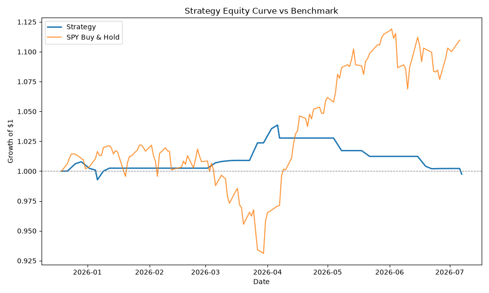

# Quantitative Sentiment Trading Engine


A high-performance algorithmic trading engine designed to execute sentiment-driven strategies utilizing Natural Language Processing (NLP). This system leverages a custom-tuned FinBERT Transformer model to parse financial news, calculate time-decayed sentiment momentum, and systematically backtest strategies with automated risk controls.

## Technology Stack and Machine Learning Models

This project serves as a comprehensive demonstration of full-stack quantitative engineering, featuring hands-on implementation of the following technologies:

* **Deep Learning and NLP Core:** Utilizes the **Hugging Face Transformers** library and **PyTorch** to run local edge inference. The core model is `ProsusAI/finbert`, a specialized BERT architecture pre-trained extensively on financial corpora (10-K reports, financial news) to accurately contextualize market-specific jargon.
* **Parameter-Efficient Fine-Tuning (PEFT):** Implements **LoRA (Low-Rank Adaptation)** to apply custom-trained weights over the base FinBERT model. This demonstrates the ability to adapt massive language models dynamically at runtime, optimizing for CPU-efficient local execution without cloud dependency.
* **Data Engineering:** Manages live data ingestion and rate-limiting utilizing the **Finnhub API** for unstructured news scraping and `yfinance` for historical market data. Employs **Pandas** for rigorous time-series alignment and vector-based financial calculations.

## Quantitative Strategy and Risk Management

* **Mathematical Sentiment Momentum:** The engine moves beyond binary positive/negative classification by applying a Moving Average Convergence Divergence (MACD) approach to the sentiment scores ($S$):
  
  $$MACD_{sentiment} = EMA_{short}(S) - EMA_{long}(S)$$
  
  This identifies genuine trend reversals and momentum breakouts by measuring the delta between the 7-day and 30-day sentiment averages, isolating acceleration rather than static positivity.
* **Dynamic Volatility Risk Management:** Replaces static stop-loss assumptions with a volatility-adaptive framework built on the 14-day **Average True Range (ATR)**. Each position is bracketed by a stop-loss set at $2\times ATR_{14}$ below entry and a take-profit target at $3\times ATR_{14}$ above it, producing an asymmetric 1.5:1 reward-to-risk profile that automatically widens or tightens with the underlying asset's realized volatility.
* **Volatility-Adjusted Position Sizing:** Capital allocated per trade is scaled inversely to each asset's ATR, so every position risks roughly the same fraction of capital if its stop is hit, regardless of how volatile the underlying instrument is (capped to prevent over-leveraging on unusually low-volatility names).
* **Transaction Cost Modeling:** Applies realistic commission and slippage assumptions to both the entry and exit leg of every trade, so reported PnL reflects tradable, cost-adjusted returns rather than frictionless theoretical performance.
* **Risk-Adjusted Performance Evaluation:** Beyond raw PnL, the backtester marks the portfolio to market on every business day: each trade's return is spread across the business days it was actually held, and multiple trades open on the same day (across different stocks, or opposing signals on the same stock) are summed rather than queued up sequentially as if only one position could ever be open at a time. This daily series is compounded into an equity curve and used to report **Sharpe Ratio**, **Sortino Ratio** (downside-only volatility), and **Maximum Drawdown**, annualized off the standard 252 trading-day convention rather than raw trade count. Results are benchmarked against a **SPY buy-and-hold** equity curve over the identical period to report alpha, rather than presenting the strategy's return in isolation.

## System Architecture

The pipeline is entirely self-contained, prioritizing latency optimization and security by keeping model inference and trading logic on local hardware.

1. **Ingestion:** Fetches chronological market data and news headlines.
2. **Inference:** Loads LoRA weights into FinBERT to classify sentiment polarity and magnitude.
3. **Signal Generation:** Applies the MACD decay function to output Bullish, Bearish, or Neutral signals based on momentum thresholds.
4. **Execution Simulation:** Parses signals through the risk engine to log entries, exits, and capital fluctuations.
5. **Performance Evaluation:** Aggregates trade-level returns into a compounded equity curve, computes Sharpe/Sortino/Max Drawdown, and plots the result against a SPY buy-and-hold benchmark.

## Installation and Setup

**1. Clone the repository**
```bash
git clone https://github.com/Asokh1/finbert-trading-engine.git
cd finbert-trading-engine
```

**2. Initialize the Virtual Environment**
```bash
python -m venv .venv
```
*Windows Authorization and Activation:*
```powershell
Set-ExecutionPolicy -Scope Process -ExecutionPolicy RemoteSigned
.\.venv\Scripts\Activate.ps1
```
*macOS/Linux Activation:*
```bash
source .venv/bin/activate
```

**3. Install Dependencies**
```bash
pip install -r requirements.txt
```

**4. Environment Configuration**
Create a `.env` file in the root directory and configure your Finnhub API key:
```env
FINNHUB_API_KEY=your_api_key_here
```

## Usage Documentation

### Momentum Analysis
To calculate the MACD sentiment momentum for a specific ticker over 7-day and 30-day windows:
```bash
python momentum.py
```
*Outputs the short-term and long-term averages alongside the MACD momentum value and a calculated trend signal.*

### Live Sentiment Analysis
To analyze the current instantaneous sentiment for a specific equity:
```bash
python live_sentiment.py
```
*Outputs the raw negative/positive classification and probability scores based on the most recent news articles.*

### Strategy Backtesting
To run the historical simulation across a portfolio of assets, applying the ATR-based stop-loss/take-profit and volatility-adjusted position sizing:
```bash
python backtest.py
```
*Outputs a detailed trade ledger, including entry/exit pricing, position size, individual trade returns, and how each trade closed (stopped out, target hit, or time-based exit), followed by aggregate win rate, cost-adjusted Cumulative PnL, and risk-adjusted performance metrics benchmarked against SPY buy-and-hold:*

```
DATE         SYM    SIGNAL                 PRICE IN   PRICE OUT  SIZE     RETURN
=====================================================================================
2026-01-04   AMZN   BEARISH (SHORT)        $233.06    $241.69    0.27   x  -3.91%  [STOPPED OUT]
2026-03-01   AMZN   BULLISH (BUY)          $208.39    $213.49    0.18   x   2.24%
2025-12-21   TSLA   BEARISH (SHORT)        $488.73    $459.64    0.14   x   5.76%
2025-12-28   TSLA   BEARISH (SHORT)        $459.64    $451.67    0.13   x   1.54%
2026-03-01   TSLA   BEARISH (SHORT)        $403.32    $398.68    0.15   x   0.95%
2026-03-08   TSLA   BEARISH (SHORT)        $398.68    $395.56    0.15   x   0.58%
2026-05-03   TSLA   BEARISH (SHORT)        $392.51    $422.39    0.13   x  -7.83%  [STOPPED OUT]
2026-05-17   TSLA   BEARISH (SHORT)        $409.99    $426.01    0.12   x  -4.12%
2025-12-28   AAPL   BULLISH (BUY)          $273.25    $266.76    0.34   x  -2.57%
2026-03-29   AAPL   BULLISH (BUY)          $246.40    $261.59    0.24   x   5.95%  [TARGET HIT]
2026-04-05   AAPL   BULLISH (BUY)          $258.62    $248.01    0.24   x  -4.29%  [STOPPED OUT]
2026-06-14   AAPL   BULLISH (BUY)          $296.42    $297.01    0.19   x  -0.00%
2026-03-22   MSFT   BEARISH (SHORT)        $382.17    $360.88    0.27   x   5.38%  [TARGET HIT]
2026-06-14   MSFT   BULLISH (BUY)          $399.76    $372.84    0.15   x  -6.92%  [STOPPED OUT]
2026-06-21   MSFT   BULLISH (BUY)          $367.34    $368.57    0.15   x   0.13%
2026-07-05   MSFT   BULLISH (BUY)          $386.74    $390.99    0.15   x   0.90%
2026-01-04   GOOGL  BULLISH (BUY)          $316.13    $331.43    0.26   x   4.63%
2026-07-05   GOOGL  BULLISH (BUY)          $366.46    $352.51    0.15   x  -4.00%
=====================================================================================
Total Trades Taken:  18
Winning Trades:      10
Win Rate:            55.6%
Cumulative PnL:      -0.25%
Sharpe Ratio:        -0.15
Sortino Ratio:       -0.11
Max Drawdown:        -3.96%
Benchmark (SPY B&H): 10.97%
Alpha vs Benchmark:  -11.22%
Equity curve saved to equity_curve.png
```



*Note: with only 18 trades per run, the Sharpe/Sortino/drawdown figures above are illustrative of the evaluation methodology, not statistically significant estimates of the strategy's true risk-adjusted performance — a much larger trade sample would be needed for that. Over this particular window the strategy underperformed SPY buy-and-hold (negative alpha), which the backtester reports directly rather than omitting. The focus of this project is the engineering of the risk and evaluation pipeline itself (ATR-adaptive stops/targets, volatility-scaled position sizing, cost-adjusted PnL, daily portfolio-level mark-to-market accounting for overlapping positions, and honest benchmark-relative reporting), not a curve-fit claim of profitability.*
