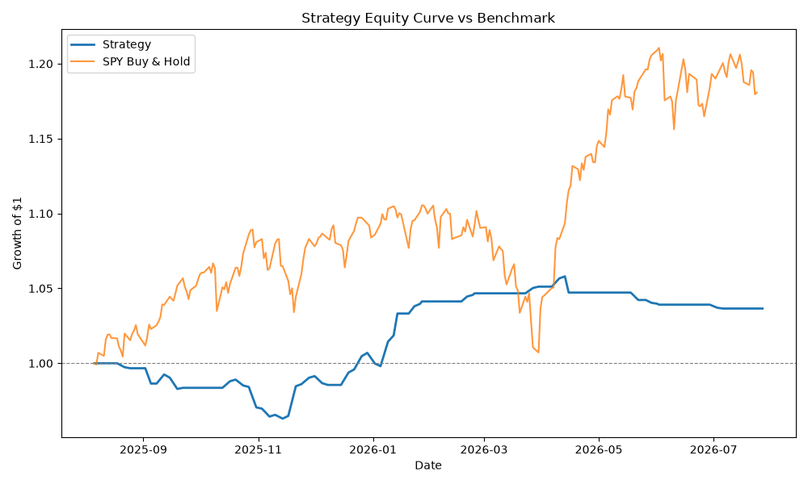

# Quantitative Sentiment Trading Engine


Scores financial news headlines with a fine-tuned FinBERT model, turns that into a sentiment-momentum signal, and backtests it as a trading strategy with ATR-based stops, volatility-scaled position sizing, and transaction costs. Runs entirely on CPU, no cloud inference involved.

## Stack

- **Model:** `ProsusAI/finbert`, a BERT variant pretrained on financial text (10-Ks, news), fine-tuned further with **LoRA**. The adapter trains on top of FinBERT's existing positive/negative/neutral head instead of swapping in a fresh binary head, so the ~0.3% of parameters it updates build on the existing financial-sentiment pretraining rather than discarding it.
- **Data:** headlines from the **Finnhub** API, price history from `yfinance`. All API calls go through a shared retry layer (`api_utils.py`) with backoff and a floor delay between requests — the free tier throttles hard enough under back-to-back calls that a naive script quietly loses a large chunk of its requests to timeouts.
- **Everything else:** PyTorch/Transformers for inference, Pandas for the time-series work.

## Strategy

- **Sentiment momentum:** each headline gets classified positive/negative/neutral, then folded into a single positivity score (neutral mass is split toward 0.5 so a neutral headline doesn't read as bullish or bearish). The signal is a MACD applied to that score — the delta between a 3-day and 14-day half-life EWMA:

  $$MACD_{sentiment} = EMA_{short}(S) - EMA_{long}(S)$$

  That picks out acceleration and reversals instead of just "is sentiment positive right now."
- **Stops and targets:** a 14-day ATR sets the stop at 2x ATR and the target at 3x ATR (1.5:1 reward-to-risk), so both scale with how volatile the stock actually is instead of using a fixed dollar or percent stop.
- **Position sizing:** scaled inversely to ATR so every trade risks roughly the same fraction of capital regardless of how volatile the underlying is, capped so a tight stop can't push leverage too high.
- **Costs:** commission and slippage applied on both legs of every trade, so the PnL numbers are cost-adjusted rather than theoretical.
- **Performance reporting:** the backtest marks the portfolio to market daily — each trade's return spread across the days it was held, overlapping trades summed instead of treated as sequential — then reports Sharpe, Sortino, and max drawdown off that daily equity curve (252-day annualization), benchmarked against SPY buy-and-hold for alpha.

## Model training and evaluation

`train_finbert.py` fine-tunes the FinBERT head with LoRA on an 80/20 split and reports accuracy, macro-F1, per-class F1, and a confusion matrix each epoch instead of just tracking loss, and picks the best checkpoint by macro-F1. A recent run:

- **Accuracy: 83.6%, macro-F1: 0.78**
- Per-class F1 — positive 0.75, negative 0.69, neutral 0.89
- Confusion matrix (rows = true label, cols = predicted; order positive/negative/neutral):
  ```
  [ 288   22   81]   true positive  (recall 73.7%)
  [  28  197   60]   true negative  (recall 69.1%)
  [  57   65 1111]   true neutral   (recall 90.1%)
  ```

Neutral makes up about 65% of the test set, so raw accuracy overstates how good the model is — macro-F1 is the fairer number. Negative is the weakest class and gets confused with neutral most often.

One caveat worth flagging: this eval runs on held-out **Twitter** financial-sentiment data (`zeroshot/twitter-financial-news-sentiment`), the same distribution the model trains on. The live pipeline scores **news headlines**, which read differently than tweets in length and phrasing. So 83.6% here doesn't guarantee the same accuracy on the actual inference input — checking that against a small hand-labeled sample of real Finnhub headlines is the obvious next step.

## How it fits together

1. Pull price history and news headlines for the backtest window.
2. Score each headline with the fine-tuned FinBERT model.
3. Turn the sentiment series into a momentum signal and threshold it into bullish/bearish/neutral.
4. Simulate entries and exits against the ATR stop/target logic, tracking size and cost.
5. Roll trade-level returns into a daily equity curve and compute Sharpe/Sortino/drawdown against SPY.

## Setup

**1. Clone the repo**
```bash
git clone https://github.com/Asokh1/finbert-trading-engine.git
cd finbert-trading-engine
```

**2. Set up a virtual environment**
```bash
python -m venv .venv
```
Windows:
```powershell
Set-ExecutionPolicy -Scope Process -ExecutionPolicy RemoteSigned
.\.venv\Scripts\Activate.ps1
```
macOS/Linux:
```bash
source .venv/bin/activate
```

**3. Install dependencies**
```bash
pip install -r requirements.txt
```

**4. Add your API key**

Create a `.env` file in the repo root:
```env
FINNHUB_API_KEY=your_api_key_here
```

## Usage

### Momentum check
```bash
python momentum.py
```
Prints the short-term and long-term EWMA sentiment averages, the MACD momentum value, and a signal label for a ticker.

### Live sentiment
```bash
python live_sentiment.py
```
Prints the current positive/negative/neutral read on a ticker's most recent headlines, with confidence.

### Backtest
```bash
python backtest.py
```
Prints a full trade ledger — entries, exits, size, return, how each trade closed — followed by win rate, cumulative PnL, Sharpe/Sortino/drawdown, and the SPY comparison:

```
DATE         SYM    SIGNAL                 PRICE IN   PRICE OUT  SIZE     RETURN
=====================================================================================
2025-08-17   AMZN   BULLISH (BUY)          $231.49    $227.94    0.19   x  -1.73%
2025-09-14   AMZN   BULLISH (BUY)          $231.43    $227.63    0.24   x  -1.84%
2025-10-12   AMZN   BEARISH (SHORT)        $220.07    $216.48    0.22   x   1.43%
2025-10-26   AMZN   BEARISH (SHORT)        $226.97    $238.18    0.20   x  -5.15%  [STOPPED OUT]
2025-11-02   AMZN   BULLISH (BUY)          $254.00    $239.38    0.17   x  -5.95%  [STOPPED OUT]
2025-11-09   AMZN   BEARISH (SHORT)        $248.40    $232.87    0.15   x   6.06%
2025-11-30   AMZN   BULLISH (BUY)          $233.88    $226.89    0.19   x  -3.18%
2025-12-14   AMZN   BULLISH (BUY)          $222.54    $228.43    0.25   x   2.44%
2026-06-28   AMZN   BEARISH (SHORT)        $240.14    $244.16    0.13   x  -1.88%
2025-08-31   TSLA   BEARISH (SHORT)        $329.36    $352.73    0.14   x  -7.31%  [STOPPED OUT]
2025-09-07   TSLA   BULLISH (BUY)          $346.40    $384.32    0.14   x  10.72%  [TARGET HIT]
2025-09-14   TSLA   BULLISH (BUY)          $410.04    $434.21    0.14   x   5.68%
2025-10-12   TSLA   BULLISH (BUY)          $435.90    $447.43    0.10   x   2.44%
2025-10-26   TSLA   BEARISH (SHORT)        $452.42    $468.37    0.12   x  -3.73%
2025-11-02   TSLA   BEARISH (SHORT)        $468.37    $445.23    0.13   x   4.75%
2025-12-14   TSLA   BULLISH (BUY)          $475.31    $488.73    0.17   x   2.62%
2025-12-21   TSLA   BEARISH (SHORT)        $488.73    $459.64    0.14   x   5.76%
2026-01-04   TSLA   BEARISH (SHORT)        $451.67    $448.96    0.13   x   0.40%
2026-04-12   TSLA   BEARISH (SHORT)        $352.42    $381.91    0.12   x  -8.58%  [STOPPED OUT]
2026-05-17   TSLA   BEARISH (SHORT)        $409.99    $426.01    0.12   x  -4.12%
2026-05-24   TSLA   BULLISH (BUY)          $433.59    $423.74    0.12   x  -2.47%
2025-09-14   AAPL   BEARISH (SHORT)        $236.03    $245.27    0.26   x  -4.12%  [STOPPED OUT]
2025-10-19   AAPL   BULLISH (BUY)          $261.50    $268.05    0.25   x   2.30%
2025-11-09   AAPL   BEARISH (SHORT)        $268.93    $266.96    0.26   x   0.53%
2025-11-16   AAPL   BULLISH (BUY)          $266.96    $275.41    0.24   x   2.96%
2025-11-23   AAPL   BULLISH (BUY)          $275.41    $282.58    0.23   x   2.40%
2025-12-21   AAPL   BULLISH (BUY)          $270.47    $273.25    0.30   x   0.83%
2025-12-28   AAPL   BULLISH (BUY)          $273.25    $266.76    0.34   x  -2.57%
2026-01-04   AAPL   BEARISH (SHORT)        $266.76    $259.77    0.32   x   2.43%
2026-02-15   AAPL   BULLISH (BUY)          $263.64    $271.89    0.18   x   2.92%
2026-03-22   AAPL   BEARISH (SHORT)        $251.26    $246.40    0.24   x   1.74%
2026-06-14   AAPL   BULLISH (BUY)          $296.42    $297.01    0.19   x  -0.00%
2025-09-07   MSFT   BEARISH (SHORT)        $495.06    $509.71    0.34   x  -3.16%  [STOPPED OUT]
2025-10-19   MSFT   BEARISH (SHORT)        $513.54    $530.09    0.31   x  -3.43%  [STOPPED OUT]
2025-11-09   MSFT   BEARISH (SHORT)        $502.82    $504.30    0.24   x  -0.50%
2025-11-16   MSFT   BEARISH (SHORT)        $504.30    $471.95    0.23   x   6.23%  [TARGET HIT]
2025-12-21   MSFT   BULLISH (BUY)          $482.77    $484.94    0.29   x   0.25%
2026-01-11   MSFT   BEARISH (SHORT)        $475.06    $455.62    0.37   x   3.90%  [TARGET HIT]
2026-04-05   MSFT   BULLISH (BUY)          $372.07    $383.54    0.23   x   2.88%
2025-11-09   GOOGL  BULLISH (BUY)          $289.53    $272.66    0.17   x  -6.02%  [STOPPED OUT]
2025-11-30   GOOGL  BEARISH (SHORT)        $314.28    $313.31    0.13   x   0.11%
2026-01-04   GOOGL  BULLISH (BUY)          $316.13    $331.43    0.26   x   4.63%
2026-01-18   GOOGL  BULLISH (BUY)          $321.58    $334.12    0.21   x   3.69%
=====================================================================================
Total Trades Taken:  43
Winning Trades:      25
Win Rate:            58.1%
Cumulative PnL:      3.65%
Sharpe Ratio:        1.48
Sortino Ratio:       1.95
Max Drawdown:        -3.70%
Benchmark (SPY B&H): 18.07%
Alpha vs Benchmark:  -14.42%
Equity curve saved to equity_curve.png
```



A couple of things worth knowing about this result. The ~355-day window is close to the limit of what Finnhub's free-tier news endpoint actually returns — go back further than ~365 days and requests start coming back empty. An earlier version of the backtest also had a real bug: Finnhub read-timeouts were caught with a bare `except: pass`, so once the free tier started throttling repeated requests, a date that failed to fetch news looked identical in the output to a date with no news at all — no error, nothing. That was quietly dropping about two-thirds of the candidate dates. Fixing it (`api_utils.py` — longer timeout, retries with backoff, a floor delay between requests) roughly tripled the trade count and moved the Sharpe/Sortino numbers above noticeably, which is why they won't match figures from earlier commits — that older sample was incomplete without any indication of it.

The momentum threshold (`|momentum| > 0.01`) is tuned on the same window it's tested on rather than a separate calibration split, and a rough holdout check showed the typical size of the momentum signal isn't stable over time — a threshold tuned on one period can misfire on another. That's still an open problem here, not a solved one. Over this window the strategy trailed SPY buy-and-hold, mostly because SPY had an unusually strong run and a long/short strategy taking 43 trades across 5 names was never going to capture that much of a broad market move. The point of this project isn't a profitability claim — it's the risk and evaluation machinery: ATR-based stops and sizing, cost-adjusted PnL, daily mark-to-market accounting for overlapping trades, and reporting results against a real benchmark instead of in isolation.
